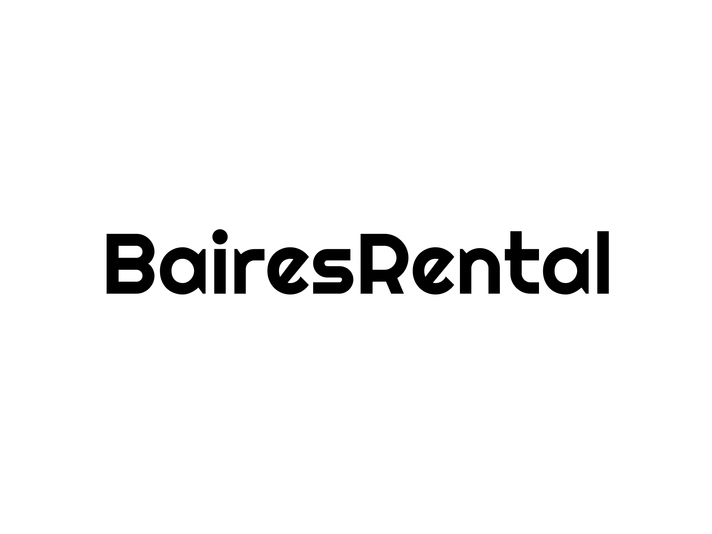

# Estrategia de Meta Ads — BairesRental

Carpeta de trabajo para pensar cómo llevar más tráfico y consultas reales al catálogo:
https://www.bairesrental.com.ar/departamentos.html

Presupuesto actual: **~USD 200/mes**.

---

## Diagnóstico (revisado en el código del sitio, 2026-08-13)

- El **Meta Pixel** (`1704524150703684`) está instalado en `index.html` y `departamentos.html`, pero **solo dispara `PageView`**. No hay ningún evento de conversión (`Contact`, `Lead`, `WhatsApp click`) cableado.
- Esto significa que, aunque las campañas estén configuradas como "Conversiones" o "Tráfico", **Meta no tiene ninguna señal de qué visita termina en una consulta real** — solo sabe qué visita entró a la página. El algoritmo optimiza para gente que hace clic/entra, no para gente que consulta. Es la explicación más probable de por qué hay tráfico pero poca conversión: **el pixel nunca aprendió a quién targetear**.
- El catálogo tiene un botón flotante de WhatsApp con mensaje pre-armado ("Hola! Quiero información sobre los departamentos.") — es el punto de conversión real, pero no está instrumentado.
- Problema reportado: los reels de contenido de Buenos Aires (que sí generan buen engagement) redirigen al perfil de Instagram en vez del catálogo o WhatsApp — se pierde la intención justo en el paso final.
- Los carruseles/videos directos de departamentos individuales rinden peor — consistente con que ese formato pide más "trabajo cognitivo" (elegir un depto específico) antes de generar confianza suficiente para escribir.

## Por qué probablemente no está convirtiendo

1. **Sin evento de conversión real, no hay optimización posible.** Cualquier campaña que uses (Tráfico, Interacción, Conversiones sin evento válido) termina optimizando para clics baratos, no para gente con intención de alquilar.
2. **El embudo está invertido.** El contenido que mejor engancha (reels de BA) no lleva al punto de conversión (WhatsApp/catálogo), y el contenido que sí lleva a conversión (fotos de deptos) es el que menos engancha en el scroll.
3. **Mostrar deptos individuales en el ad compite mal con el catálogo.** Un carrusel de "este depto en Palermo" filtra de más — si a alguien no le gusta ese depto puntual, rebota, aunque el resto del catálogo le sirva.

---

## Recomendaciones (en orden de impacto/esfuerzo)

### 1. Instrumentar eventos de conversión (antes que nada)
Sin esto, cualquier optimización de Meta sigue a ciegas.

- Agregar `fbq('track', 'Contact')` al click del botón flotante de WhatsApp y a los demás links `wa.me` (nav, footer, "consultar por WhatsApp" del catálogo).
- Si el volumen de WhatsApp lo justifica, migrar a **anuncios de clic a WhatsApp** (Click-to-WhatsApp Ads): el objetivo "Mensajes" en Meta Ads Manager abre el chat directo de WhatsApp y manda el evento `Lead`/conversación iniciada nativamente, sin depender del pixel del sitio. Con USD 200/mes y bajo volumen, esto suele funcionar mejor que optimizar por pixel (que necesita ~50 eventos/semana para salir de aprendizaje).

### 2. Redirigir los reels de Buenos Aires al catálogo o a WhatsApp, no al perfil de IG
- El perfil de IG es un paso extra sin CTA claro. Cambiar el destino a `departamentos.html` (o directo a `wa.me/5491173735757`) recupera intención que hoy se pierde.
- Mantener el reel como contenido de descubrimiento/marca, pero con CTA explícito en texto y sticker de link: "Mirá los deptos disponibles 👇".

### 3. Separar el embudo en dos tipos de campaña
- **Awareness/Alcance (contenido BA / lifestyle):** presupuesto bajo, objetivo interacción o alcance, destino = catálogo. Sirve para construir audiencia y dar material para retargeting.
- **Retargeting/Conversión (carrusel de catálogo o mensajes directos):** a quienes vieron el reel, visitaron el catálogo o interactuaron con el Instagram/Facebook en los últimos 14-30 días. Objetivo Mensajes o Conversiones (evento `Contact`). Este es el tramo que realmente cierra consultas.

Con USD 200/mes, algo como 60% awareness liviano / 40% retargeting suele rendir mejor que todo mezclado en una sola campaña de tráfico genérico.

### 4. Repensar el creative de catálogo
- En vez de "este depto puntual", probar carruseles tipo "3 deptos disponibles esta semana en Palermo/Recoleta" — reduce el rebote por gusto individual y empuja al catálogo completo.
- Data point del código: el catálogo ya filtra por barrio, tipo, precio — vale la pena que el ad linkee con un filtro pre-aplicado (ej. `departamentos.html?barrio=palermo`) si eso existe, para bajar fricción.

### 5. Segmentación
- Nicho diferenciador: **nómadas digitales**. Vale una campaña separada con intereses tipo "remote work", "digital nomad", geos EE.UU./Europa, idioma inglés, landing/creative en inglés.
- Geo local (Argentina/CABA) para el segmento propietarios — campaña distinta, mensaje distinto ("dejá de ocuparte del alquiler, ganá en USD").

### 6. Medición
Con presupuesto chico, mirar semanalmente:
- **Costo por conversación de WhatsApp iniciada** (no CPC ni CPM sueltos) — es la métrica que importa.
- CTR por creative para decidir qué formato escalar.
- Con Click-to-WhatsApp Ads esto se ve directo en Ads Manager sin pixel.

---

## Próximos pasos a definir juntos
- [ ] Confirmar objetivo actual de campaña en Ads Manager (Tráfico / Conversiones / Interacción / Mensajes)
- [ ] Decidir si migramos a Click-to-WhatsApp Ads como formato principal
- [ ] Agregar tracking de `Contact` a los links de WhatsApp del sitio
- [ ] Definir 2-3 creatives de catálogo tipo "varios deptos" para probar contra los de depto individual
- [ ] Armar público de retargeting (visitas a la web + engagement IG/FB 30 días)
